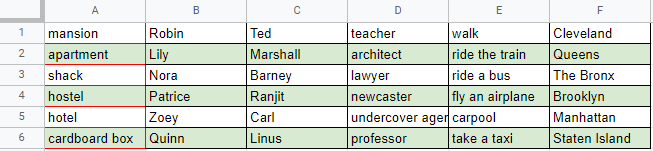
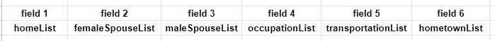

# Module 5 Lab Guide (part 2)

## Lab Activity 2 - HousingCrunch (Required)
### Problem Description
For this lab activity, the HousingCrunch activity in part 1 will be modified to load housing data from a CSV file instead of having the options manually added to the houseList (also known has hardcoded values). In addition to prompting the user for name and a seed value, the program should also prompt for the filename containing the housing data. The data file will contain more data fields than will be used in this application as we are only interested in the housing data stored in the 1st field. The screenshot below shows a spreadsheet view of the provided CSV data with the first field of each row outlined in red.



***It will be extremely helpful to review the CSVParser Deeper Look Video and Guided Experimentation examples before starting on this activity.***

NOTE:  In Computer Science we teach students to begin counting at zero because zero is the first index value of arrays, strings and many other programming related things.  When working with data from muggles (non-programmer folk), the first data element is often referred to as *record 1* or *row 1* or *column A* or *field 1*. Just open a spreadsheet and look at the column and row identifiers.  As programmers it is our responsibility to be aware of this difference and make certain our programs behave correctly.

#### Expected Program Output (with sample user input)
```
Please enter your name: Luke
Please enter a seed value: 123
Please enter the filename: MASHDatabase.csv

Hello Luke,
You should buy a shack.
```

#### Expected Program Output (with sample user input)
```
Please enter your name: Luke
Please enter a seed value: 9853482
Please enter the filename: MASHDatabase.csv

Hello Luke,
You should buy a hotel.
```

#### Expected Program Output (with sample user input)
```
Please enter your name: Luke
Please enter a seed value: 123
Please enter the filename: missing.csv
Error: File does not exist.
Please enter the filename: mashdatabase.csv
Error: File does not exist.
Please enter the filename: MASHDatabase.csv

Hello Luke,
You should buy a shack.
```

### Program Design
Please copy LabUtility.java and HousingCrunch.java from the HousingCrunch activing in part 1 into the HousingCrunch folder.  This will allow reuse of both the getName() and getSeed() static methods. Use the javadoc comments below to implement two additional static methods in the LabUtility class.

```
/**
 * Prompt the user to enter a filename then user the provided
 *     Scanner object to read the entire line of user input as
 *     a String value. Use this value to create a new File object
 *     then use the exists() and isFile() methods to check that
 *     the user specified file is valid.  If the file does not
 *     exist or is not a file, display an error message and prompt
 *     the user again. If the file is valid, return the File object
 *     to the caller.
 * @param kbd Scanner object bound to System.in
 * @return Valid File object that represents the filename entered by the user.
 */
public static File getFile(Scanner kbd) {...}
``` 

```
/**
 * This method begins by creating a new ArrayList of Strings. It then 
 *     attaches a Scanner to the provided File object and uses a while
 *     loop to process the file line-by-line. For each line, this method creates
 *     a new Scanner object with a comma "," delimiter to to enable access the
 *     individual fields within the line using a second, inner while loop. As each
 *     field is processed it is tracked using a counter variable starting with
 *     field 1. If the current field is equal to the specified fieldNumber, the
 *     String value of the field is added to the list.  Once all the lines in the 
 *     file have been processed, the ArrayList is returned to the caller.
 * 
 * If Scanner throws a FileNotFoundException when instantiating the new file 
 *     Scanner object, catch the expection, display an error message, and exit 
 *     the program immediately with an exit status of 1.
 * 
 * @param csvFile File object that contains the CSV database to process
 * @param fieldNumber Field number to use for building the list
 * @return ArrayList of strings that represents the desired column of data from the database.
 */
public static ArrayList<String> buildListFromCSV(File database, int fieldNumber) {...}
```

Once the above static methods have been successfully implemented, they can easily be integrated into HousingCrunch.java by first removing removing the hard-coded homeList and replacing it with the following method calls. Note that the number "1" in the call to buildListFromCSV() indicates that the homeList should be built from the first field in the CSV file.
```
File csvFile = LabUtility.getFile(kbd);
ArrayList<String> homeList = LabUtility.buildListFromCSV(csvFile,1);
```

### Implementation Guide
1. Expand the folder named HousingCrunch, copy LabUtility.java and HousingCrunch.java from part 1 into this folder
2. Implement the static methods in LabUtility.java then update HousingCrunch.java as shown above to call these static methods
3. Test the program using the sample user input and compare against the expected output.
4. Commit the changes to your local repository with a message stating that Lab Activity 2 is completed.
5. Push the changes from your local repository to the github classroom repository.

## Lab Activity 3 - MASHGame (Required)
### Problem Description

M.A.S.H. is a text-based game that will predict your future!  M.A.S.H. is an abbreviation for potential future places of residence: Mansion, Apartment, Shack, House. :)

Write a program that prompts the user for their name and the filename contain a CSV formatted database. The database is formatted as shown in the image below with field 1 cooresponding to the homeList, field 2 cooresponding to the femaleSpouseList and so on... with each column of data will be stored in a list. 



The program will make random selections from each list and use those values complete the following template and predict the user's future.

> Welcome **[name]**, this is your future...  
> You will marry **[random from maleSpouseList or femaleSpouseList]** and live in a **[random from homeList]**. 
> After **[random int]** years of marriage, you will finally get your dream job of being a **[random from occupationList]**. 
> Your family will move to a **[random from homeList]** in **[random from hometownList]** where you will **[random from transportationList]** to work each day. 

The program does not ask for a seed value simply because there is enough variablity in both the database CSV file as well as the order that the random calls are made to make an exact comparison difficult. I am providing expected output below with the understanding that the randomly selected value will be different each time the program is run. Once you have the base implementation working, you are welcome to create a custom version of the MASHDatabase.csv with your own theme.  :)

#### Expected Program Output (with sample user input)
```
Please enter your name: Luke
Please enter the filename: MASHDatabase.csv

Welcome Luke, this is your future... 
You will marry Barney and live in a shack. 
After 7 years of marriage, you will finally get your dream job of being a teacher. 
Your family will move to a apartment in The Bronx where you will walk to work each day. 

```

### Program Design
Please copy LabUtility.java from the HousingCrunch activity into the MASHGame folder. In the main() method of MASHGame.java, begin by using the getName() and getFilename() static methods from the LabUtility class to prompt the use for the required information.  Then use the buildListFromCSV() static method to extract the cooresponding field for each list from the CSV file and create the cooresponding ArrayList as shown in the code below.

```
ArrayList<String> homeList = LabUtility.buildListFromCSV(csvFile,1);
ArrayList<String> femaleSpouseList = LabUtility.buildListFromCSV(csvFile,2);
ArrayList<String> maleSpouseList = LabUtility.buildListFromCSV(csvFile,3);
ArrayList<String> occupationList = LabUtility.buildListFromCSV(csvFile,4);
ArrayList<String> transportationList = LabUtility.buildListFromCSV(csvFile,5);
ArrayList<String> hometownList = LabUtility.buildListFromCSV(csvFile,6);
```

Once the lists have been created and populated with data, use the technique demonstrated in the MagicEightBall example to make random selections from each list and store the result to a variable. Finally, use print statements and string concatenation to create the user's future.


### Implementation Guide
1. Expand the folder named MASHGame, copy LabUtility.java from HousingCrunch and open MashGame.java
2. Design a program to satisfy the requirements in the Problem Description and Program Design sections
3. Design a program to satisfy the requirements in the Problem Description and Program Design sections
4. Commit the changes to your local repository with a message stating that Lab Activity 3 is completed.
5. Push the changes from your local repository to the github classroom repository.

## Coding Journal (Optional)
Keep a journal of your activities as you work on this lab. Many of the best engineers that I have worked with professionally have kept some sort of engineering journal. I personally packed notebooks around with me for nearly 8 years before I began keeping my notes electronically.   

Your journal can track ideas, bugs, cool links, code snippets, shell commands, rants, or simply a reflection on what worked well or not-so-well with this lab activity. I will not be grading the content of your journal, but I will expect at least two timestamped journal entries of at least a 75 to 150 words each added to the provided Journal.md file.  The purpose of this component is to help develop the habit of taking notes and creating documentation while you code. The more detail you provide the better as that will help you if you ever need to refer back to this project in the future.

## Markdown Resources
Markdown is a notation that is used to format text documents.  It is widely used in Software Development shops around the world, which is why we're asking you to use it in your lab documentation.  

Github provides a guide for getting started:  [Mastering Markdown](https://guides.github.com/features/mastering-markdown/)


